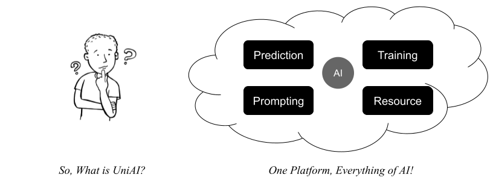

<!-- @format -->

#  UniAI

[简体中文版](./README_CN.md)


## Integrated Models

-   [OpenAI GPT](https://platform.openai.com)
-   [OpenAI DALL-E](https://platform.openai.com)
-   [Midjourney](https://github.com/novicezk/midjourney-proxy)
-   [THUDM ChatGLM3](https://github.com/THUDM/ChatGLM3)
-   [Stable Diffusion](https://github.com/AUTOMATIC1111/stable-diffusion-webui)
-   [IFLYTEK Spark](https://xinghuo.xfyun.cn)

## Samples

Who are using UniAI and where can I experience it?


_Notice: All of the above mini app samples depend on GLM model by UniAI!_

## About UniAI

UniAI is designed to simplify your interactions with mutiple and complex AI models.

We aim to provide an API-based platform that integrates various AI models and utilities.

## Requirements

Before you start, make sure you have:

-   Node.js >= 18.x
-   TypeScript >= 4.x
-   Docker
-   Docker-compose

## Getting Started

### Configuration

1. Create a `.env` file at the root directory:

```bash
touch ./.env
```

2. Fill in the environment parameters in the `.env` file as follows:

```bash

# APP
APP_NAME=UniAI
APP_URL=https://www.uniai.us
DEFAULT_AVATAR_AI=https://openai-1259183477.cos.ap-shanghai.myqcloud.com/avatar-lechat.png
DEFAULT_AVATAR_USER=https://openai-1259183477.cos.ap-shanghai.myqcloud.com/avatar-user.png
DEFAULT_USERNAME=AI
ADMIN_TOKEN=    # admin token

# OPENAI GPT
OPENAI_API=http://8.214.93.3
OPENAI_API_VERSION=v1
OPENAI_API_KEY=     # OpenAI API key    
OPENAI_EMBED_DIM=1536
OPENAI_DEFAULT_CHAT_MODEL=gpt-4     # gpt-4 | gpt-3.5-turbo
OPENAI_DEFAULT_EMBED_MODEL=text-embedding-ada-002 # 001 | 002

# GLM
GLM_API=http://10.144.1.7:8100 # visit https://github.com/uni-openai/GLM-API
TEXT2VEC_EMBED_DIM=1024 # use https://huggingface.co/GanymedeNil/text2vec-large-chinese


# SPARK
SPARK_API=ws://spark-api.xf-yun.com
SPARK_API_KEY=      # IFLYTEK Spark API KEY
SPARK_API_SECRET=   # IFLYTEK Spark API Secret
SPARK_APP_ID=       # IFLYTEK Spark APP ID
SPARK_DEFAULT_MODEL_VERSION=v3.1 # IFLYTEK Spark model version

# PostgreSQL database
POSTGRES_HOST=10.144.1.7    # postgresql host url
POSTGRES_PORT=5432          # postgresql port
POSTGRES_USER=postgres      # postgresql user
POSTGRES_PASSWORD=postgres  # postgresql password
POSTGRES_DB=uniai           # postgresql db

# Redis cache
REDIS_HOST=10.144.1.7       # Redis cache host url
REDIS_PORT=6379             # Redis cache host port

# WeChat
WX_APP_ID=    # wechat app id
WX_APP_SECRET=     # wechat app secret
WX_APP_AUTH_URL=https://api.weixin.qq.com/sns/jscode2session
WX_APP_ACCESS_TOKEN_URL=https://api.weixin.qq.com/cgi-bin/token
WX_APP_PHONE_URL=https://api.weixin.qq.com/wxa/business/getuserphonenumber
WX_APP_MSG_CHECK=https://api.weixin.qq.com/wxa/msg_sec_check
WX_DEFAULT_CHAT_MODEL=SPARK     # wechat default chat model
WX_DEFAULT_RESOURCE_MODEL=GLM   # wechat default resource chat model
WX_DEFAULT_EMBED_MODEL=GPT      # wechat default embed model


# COS, OSS storage
COS_SECRET_ID=      # tencent cos/oss secret id
COS_SECRET_KEY=     # tencent cos/oss secret key
COS_BUCKET=         # tencent cos/oss bucket
COS_REGION=         # tencent cos/oss region

# Google Search
GOOGLE_SEARCH_API_TOKEN=
GOOGLE_SEARCH_ENGINE_ID=

# Stable Diffusion
STABLE_DIFFUSION_API=http://10.144.1.7:3400

MID_JOURNEY_API=        # visit https://github.com/novicezk/midjourney-proxy
MID_JOURNEY_TOKEN=      # mj-proxy token

```

### Installation

We recommend using `yarn` instead of `npm`:

```bash
npm -g install yarn
yarn
```

### Start Database

If you don't have a vector database such as PostgresSQL (pgvector), you can start one using Docker and Docker-compose:

```bash
yarn docker up pgvector
```

### Initialize Database

```bash
yarn pg init --force
```

## Running UniAI

### Development Mode

```bash
yarn dev
```

### Production Mode

```bash
yarn tsc
yarn start
```

**⚠️ Do not compile TypeScript files in development mode.**
**If you have run `tsc`, use `yarn clean` before `yarn dev`.**

### Cleaning Up

```bash
yarn clean
```

## Documentation

UniAI's APIs are accessed through the common Web HTTP methods including SSE.

Please refer to the documentation at the following address:
[https://documenter.getpostman.com/view/9347507/2s93Y5Pf2J](https://documenter.getpostman.com/view/9347507/2s93Y5Pf2J)

## Models

UniAI continues to integrate more AI models and extend AI utilities. However, UniAI is not a standalone entity. Since it serves as an integration and connection point for various AI models, tools, and plugins, you'll need to deploy specific models you require on your own. We provide download URLs and guides for these models.

### NLP Models

-   OpenAI GPT: [https://platform.openai.com/docs/api-reference](https://platform.openai.com/docs/api-reference)
-   GLM/ChatGLM: [https://github.com/uni-openai/GLM-API](https://github.com/uni-openai/GLM-API)
-   IFLYTEK/SPARK: [https://www.xfyun.cn/doc/spark/Web.html](https://www.xfyun.cn/doc/spark/Web.html)

### CV Models

-   OpenAI DALL-E: [https://platform.openai.com/docs/api-reference](https://platform.openai.com/docs/api-reference)
-   Stable Diffusion: [https://github.com/uni-openai/stable-diffusion-simple](https://github.com/uni-openai/stable-diffusion-simple)
-   MidJourney: [https://github.com/novicezk/midjourney-proxy](https://github.com/novicezk/midjourney-proxy)

## Future Plans

UniAI will offer more AI capabilities across the following key features:

-   Prediction APIs
-   Training APIs
-   Prompting APIs
-   Resource APIs



## Contributors

Welcome your contributions!

Reach out to Youwei <huangyw@iict.ac.cn> for more development information.

_Powered by [Egg.js](https://www.eggjs.org/) TypeScript_
