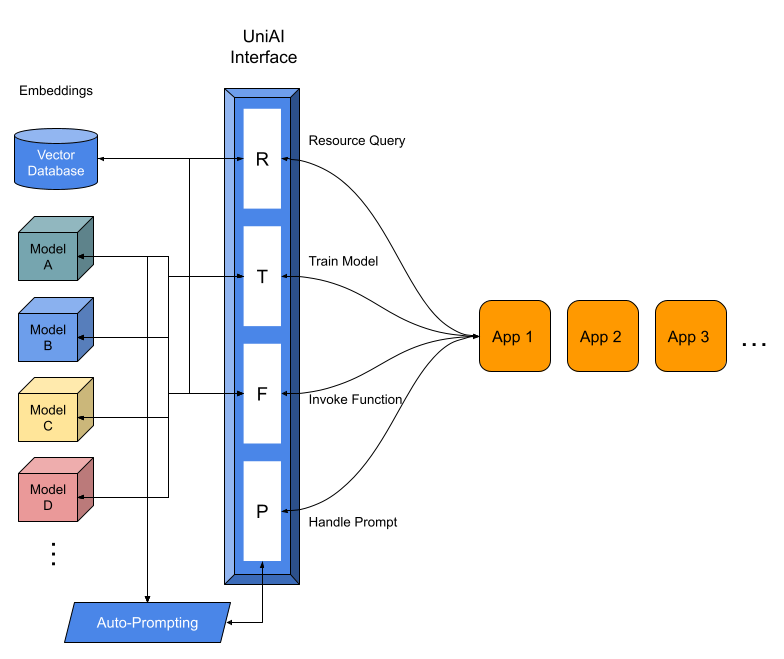
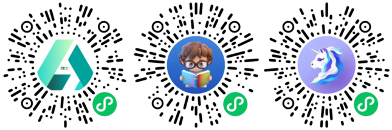

#  UniAI

[简体中文版](./README_CN.md)



## Samples

Who are using UniAI and where can I experience it?



_Notice: All of the above mini app samples use GLM model by UniAI!_

## About UniAI

UniAI is designed to simplify your interactions with complex AI models. No more struggling to choose the right model or getting lost in technical details - we're open-source and ready to help.

## Our Vision

We aim to provide an API-based platform that integrates various AI models and utilities. With UniAI, complex AI implementation becomes hassle-free and streamlined.

## Prerequisites

Before you start, make sure you have:

- Node.js >= 18.x
- TypeScript >= 4.x
- Docker
- Docker-compose

## Getting Started

### Configuration

1. Create a `.env` file at the root directory:

   ```bash
   touch ./.env
   ```
2. Fill in the environment parameters in the `.env` file as follows:

   ```bash
   # APP
   APP_NAME=UniAI
   APP_URL=[Your App Domain]

   # GPT
   OPENAI_PROXY=[Your OpenAI proxy]
   OPENAI_API_KEY=[Your OpenAI API key]
   OPENAI_EMBED_DIM=1536

   # GLM
   GLM_API=[Your GLM API]
   TEXT2VEC_EMBED_DIM=1024

   # PostgreSQL database
   POSTGRES_HOST=localhost
   POSTGRES_PORT=5432
   POSTGRES_USER=postgres
   POSTGRES_PASSWORD=postgres
   POSTGRES_DB=uniai

   # Redis cache
   REDIS_PORT=6379

   # WeChat
   WX_APP_ID=[Your Wechat MiniApp app id]
   WX_APP_SECRET=[Your Wechat MiniApp app secret]
   WX_APP_AUTH_URL=https://api.weixin.qq.com/sns/jscode2session
   WX_APP_ACCESS_TOKEN_URL=https://api.weixin.qq.com/cgi-bin/token
   WX_APP_PHONE_URL=https://api.weixin.qq.com/wxa/business/getuserphonenumber
   WX_APP_MSG_CHECK=https://api.weixin.qq.com/wxa/msg_sec_check

   # COS, OSS storage
   COS_SECRET_ID=[Your Tencent COS service secret id]
   COS_SECRET_KEY=[Your Tencent COS service secret key]
   COS_BUCKET=[Your Tencent COS service bucket]
   COS_REGION=[Your Tencent COS service region]

   # Google Search
   GOOGLE_SEARCH_API_TOKEN=[Your Google API token]
   GOOGLE_SEARCH_ENGINE_ID=[Your Google engine ID]

   # Stable Diffusion
   STABLE_DIFFUSION_API=http://10.144.1.7:3400/sdapi/v1

   # Default config for the app
   ADMIN_TOKEN=[Your administrator token]
   DEFAULT_AVATAR_AI=https://openai-1259183477.cos.ap-shanghai.myqcloud.com/avatar-ai.png
   DEFAULT_AVATAR_USER=https://openai-1259183477.cos.ap-shanghai.myqcloud.com/avatar-user.png
   DEFAULT_USERNAME=user
   ```

### Installation

We recommend using `yarn` over `npm`:

```bash
npm -g install yarn
yarn
```

### Start Database

If you don't already have a vector database such as Milvus or PostgresSQL (pgvector), you can start one using Docker and Docker-compose:

```bash
yarn docker up pgvector
```

### Initialize Database

```bash
yarn pg init --force
```

## Running UniAI

### Development Mode

```bash
yarn dev
```

### Production Mode

```bash
yarn tsc
yarn start
```

⚠️ Do not compile TypeScript files in development mode. If you have run `tsc`, use `yarn clean` before `yarn dev`.

### Cleaning Up

```bash
yarn clean
```

## Documentation

UniAI's interfaces are all accessed through Web APIs.

Please refer to the documentation at the following address:
[https://documenter.getpostman.com/view/9347507/2s93Y5Pf2J](https://documenter.getpostman.com/view/9347507/2s93Y5Pf2J)

## Models

UniAI continues to integrate more AI models and extend AI utilities. However, UniAI is not a standalone entity. Since it serves as an integration and connection point for AI models, tools, and plugins, you'll need to deploy specific models you require on your own. We provide download URLs and guides for these models.

### NLP Models

- OpenAI GPT: [https://www.npmjs.com/package/openai](https://www.npmjs.com/package/openai)
- GLM/ChatGLM: [https://github.com/uni-openai/GLM-API](https://github.com/uni-openai/GLM-API)

### CV Models

- Stable Diffusion: [https://github.com/uni-openai/stable-diffusion-simple](https://github.com/uni-openai/stable-diffusion-simple)

## Future Plans

UniAI will evolve to offer more AI capabilities across the following key modules:

- Prediction Interface
- Training Interface
- Prompting Interface
- Resource Interface

## Contributors

We welcome your contributions! Reach out to devilyouwei <huangyw@iict.ac.cn> for more information.

_Powered by [Egg.js](https://www.eggjs.org/) TypeScript_ 
