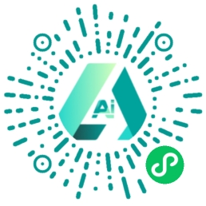

<p align=center>

</p>

<h1 align=center>UniAI MaaS Platform </h1>

<p align=center>Powered by the eponymous node.js library <a href="https://www.npmjs.com/package/uniai">uniai</a></p>

<p align=center>

</p>


## Overview

[Read this in Simplified Chinese (简体中文说明)](./README_CN.md) 🇨🇳

The platform project aims to streamline the integration of multiple models, reducing the complexity of the process for developers. This allows developers to focus more on developing business logic. The platform supports a vector database and enables users to upload, parse, and manipulate office documents. In addition to text generation models, it also offers various multimodal models such as image generation and recognition. Furthermore, the platform supports custom development for integration with platforms like WeChat Mini Programs. 

UniAI, powered by the node.js library of the same name **uniai**, provides seamless access and management of a diverse range of AI models and utilities. To incorporate UniAI into your project, you can install it via [npm](https://www.npmjs.com/package/uniai) or [Github](https://github.com/devilyouwei/UniAI).

## Integrated Models

UniAI integrates multiple AI models, including:

-   [IFLYTEK/Spark](https://xinghuo.xfyun.cn)
-   [THUDM/ChatGLM-6B](https://github.com/THUDM/ChatGLM3)
-   [ZHIPU/GLM](https://github.com/THUDM/ChatGLM3)
-   [MoonShot/moonshot](https://www.moonshot.cn/)
-   [OpenAI/GPT](https://platform.openai.com)
-   [Baidu/WenXin workshop](https://cloud.baidu.com/product/wenxinworkshop)
-   [Google/Gemini](https://makersuite.google.com/app/)
-   [Stability AI](https://platform.stability.ai/)
-   [OpenAI/DALL-E](https://platform.openai.com)
-   [Midjourney](https://github.com/novicezk/midjourney-proxy)

## 📱 Samples

Discover how UniAI is utilized and experience it firsthand:

### 💬 LeChat Mini Program



### ✨ LeChat Pro Version

👍 We recommend: <https://lechat.cas-ll.cn>


- Multi-model Chat
- Office file upload and parse
- Image generation
- Image recognition

## System Requirements

Ensure you have the following `NPM` libs installed:

-   Node.js (version >= 18) - [nvm Installation Guide](https://github.com/nvm-sh/nvm)
-   Docker & Docker-compose
-   LibreOffice for document conversion (libreoffice-convert)
-   pdf-to-img (canvas-node) - [Canvas NPM Package](https://www.npmjs.com/package/canvas)

## Getting Started

### Configuration

Create an `.env` file at the project root path:

```bash
touch ./.env
```

Fill the `.env` file with the following environment variables:

```bash

# Platform default admin token
ADMIN_TOKEN=

# OPENAI GPT
OPENAI_API= # openai proxy
OPENAI_KEY= # openai key

# Google AI studio
GOOGLE_AI_API= # google proxy
GOOGLE_AI_KEY= # google key

# ZHIPU AI
# ZHIPU_AI_API= #zhipu proxy
ZHIPU_AI_KEY= # zhipu key
GLM_API= # local deployed glm6b

# SPARK
FLY_APP_ID= # iflytek app id
FLY_API_KEY= # ilfytek api key
FLY_API_SECRET= # iflytek api secret

# baidu wenxin workshop
# BAIDU_API=http://192.168.41.52:5300
BAIDU_API_KEY=
BAIDU_SECRET_KEY=

# Moonshot
# MOONSHOT_API=http://192.168.41.52:5400
MOONSHOT_KEY=

# Stable Diffusion
STABLE_DIFFUSION_API=

# Midjourney
MJ_API= # https://github.com/novicezk/midjourney-proxy
MJ_IMG_PROXY= # proxy to discord cdn images
MJ_TOKEN= # mj token

# stability ai
STABILITY_KEY=

# other models, local deployed models, opensource models
OTHER_API=

# PostgreSQL database
DB_DIALECT=postgres
POSTGRES_HOST=localhost
POSTGRES_PORT=5432
POSTGRES_USER=postgres
POSTGRES_PASS=postgres
POSTGRES_DB=uniai

# Redis cache
REDIS_HOST=localhost
REDIS_PORT=6379
REDIS_PASS=redis
REDIS_DB=0

# WeChat
WX_APP_ID= # wechat miniapp id
WX_APP_SECRET= # wechat miniapp secret
WX_MCH_ID=
WX_PAY_PRIVATE=
WX_PAY_CERT=
WX_PAY_KEY=

# MINIO storage
MINIO_END_POINT=localhost
MINIO_ACCESS_KEY=
MINIO_SECRET_KEY=
MINIO_PORT=9000
MINIO_BUCKET=uniai

# gee code test
GEE_TEST_ID=
GEE_TEST_KEY=

# aliyun SMS account
ALI_KEY_ID=
ALI_KEY_SECRET=
ALI_SMS_TEMPLATE=
ALI_SMS_SIGN=

# For Docker start pgvector
POSTGRES_DATA_PATH=./data

# For Docker start Minio
MINIO_DATA_PATH=./data
MINIO_ROOT_USER=root
MINIO_ROOT_PASS=12345678


```

### Installation Steps

**Node-gyp Installation**

```bash
npm -g install node-gyp
```

**LibreOffice Installation**

-   Ubuntu: `sudo apt install libreoffice`
-   Mac: `brew install libreoffice`

**Node-Canvas Support**

-   Reference: [Canvas NPM Documentation](https://www.npmjs.com/package/canvas)
-   Install dependencies as per your operating system.

**Using Yarn (Recommended over npm)**

```bash
npm -g install yarn
yarn
```

**Sharp Support**

```bash
yarn add sharp --ignore-engines
```

### Starting the Database

For databases like PostgresSQL (pgvector), Docker and Docker-compose can be used for setup:

```bash
sudo apt install docker.io docker-compose
```

**Docker Commands for Database Services**

-   Start pgvector: `yarn docker up pgvector`
-   Start Redis: `yarn docker up redis`
-   Start Minio (local OSS): `yarn docker up minio`

**Important Notes**

-   Ensure proper permissions for Docker volumes.
-   Configure Minio after Docker initialization.
-   Default Docker settings are available in `.env`.

Minio Access:

-   URL: `http://localhost:9000`
-   Default Username: `root`
-   Default Password: `12345678`

### Running UniAI

**Development Mode**

-   Initializes the database.

```bash
yarn dev
```

**Production Mode**

-   Compile TypeScript files and start the application.

```bash
yarn tsc
yarn start
```

⚠️ **Important**: Avoid compiling TypeScript files in development mode. Use `yarn clean` before `yarn dev` if `tsc` was previously run.

### Cleaning Up

```bash
yarn clean
```

## Documentation

Access UniAI's APIs through common Web HTTP methods, including SSE. For detailed documentation, visit [UniAI API Documentation](https://documenter.getpostman.com/view/9347507/2s93Y5Pf2J).

## Available Models

UniAI integrates various AI models, focusing on NLP and CV domains. Specific models need to be deployed independently. Download URLs and guides are provided.

### NLP Models

-   OpenAI GPT, GLM/ChatGLM, IFLYTEK/SPARK

### CV Models

-   OpenAI DALL-E, Stable Diffusion, MidJourney

## Future Enhancements

UniAI is planning to expand its capabilities across:

-   Prediction APIs
-   Training APIs
-   Prompting APIs
-   Resource Management APIs


## Contributing

Youwei Huang <huangyw@iict.ac.cn>

Institute of Intelligent Computing Technology, Suzhou, CAS

## License

Powered by [Egg.js](https://www.eggjs.org/)


[MIT](./LICENSE)

Copyright (c) 2022-present, Youwei Huang
